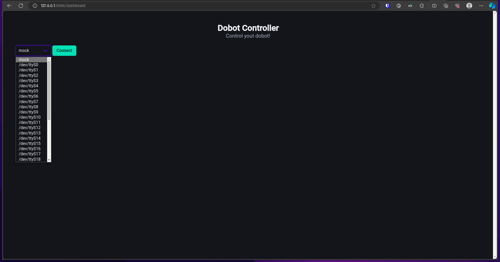
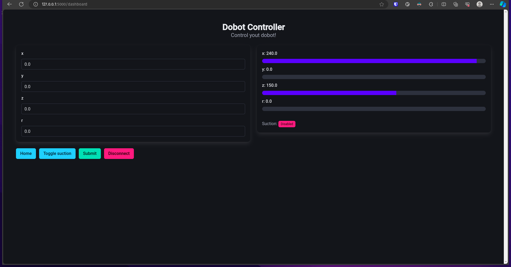
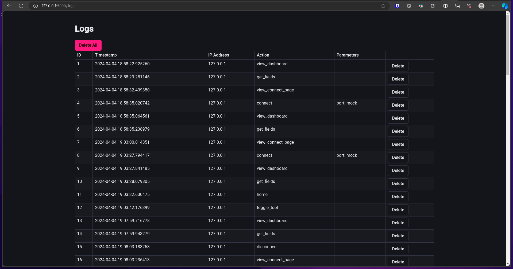

# Dobot-Controller

Um controlador para o braço robótico Dobot Magician Lite

# Interface

A interface foi desenvolvida usando Flask, HTMX e BulmaCSS

Antes de rodar a interface, é necessário instalar suas dependências

```
pip install -r requirements.txt
```

Para rodar a interface basta ir em `src` e rodar

```
flask --app app.py run
```

## Telas

### Conexão com o robô

Ao abrir a rota `/dashboard`, caso você não tenha conectado com o robô, essa tela vai aparecer



Ao clicar em `Connect` a dashboard de controle será carregada

### Dashboard



Nela, é possível controlar a posição do robô e ligar e desligar a sucção, além visualizar em tempo real as mudanças acontecendo.

Um botão de `Home` também está presente para enviar o robô para a _Home position_

### Logs



Também é possível ver todas as ações realizadas na plataforma através da rota `/logs`, onde as informações de tempo, endereço de ip, ação e parâmetros de cada ação podem ser visualizadas e excluídas.

# CLI

Para rodar o CLI basta ir em `src` e rodar

```
python main.py
```

## 1. Comando Move

### Descrição

Move o robô por uma distância específica ao longo de um eixo especificado.

### Uso

```bash
$ python src/main.py move <eixo> <distância> [--wait]
```

- `<eixo>`: Eixo a ser movido (por exemplo, X, Y, Z, R).
- `<distância>`: Distância a ser percorrida no eixo especificado.
- `--wait` (Opcional): Aguarde o movimento ser concluído (o padrão é True).

### Demonstração em Vídeo

<iframe width="560" height="315" src="https://www.youtube.com/embed/FfVcDDjsJwE" title="YouTube video player" frameborder="0" allow="accelerometer; autoplay; clipboard-write; encrypted-media; gyroscope; picture-in-picture; web-share" allowfullscreen></iframe>

---

## 2. Comando Move To

### Descrição

Move o robô para uma posição específica definida por coordenadas X, Y, Z e R.

### Uso

```bash
$ python src/main.py move_to <x> <y> <z> <r> [--wait]
```

- `<x>`: Coordenada X para mover.
- `<y>`: Coordenada Y para mover.
- `<z>`: Coordenada Z para mover.
- `<r>`: Coordenada R para mover.
- `--wait` (Opcional): Aguarde o movimento ser concluído (o padrão é True).

### Demonstração em Vídeo

<iframe width="560" height="315" src="https://www.youtube.com/embed/QbYWh5ShdzU" title="YouTube video player" frameborder="0" allow="accelerometer; autoplay; clipboard-write; encrypted-media; gyroscope; picture-in-picture; web-share" allowfullscreen></iframe>

---

## 3. Comando Home

### Descrição

Move o robô para a posição inicial (home).

### Uso

```bash
$ python src/main.py home [--wait]
```

- `--wait` (Opcional): Aguarde o robô atingir a posição inicial (o padrão é True).

### Demonstração em Vídeo

## <iframe width="560" height="315" src="https://www.youtube.com/embed/_fDZyqgdMEQ" title="YouTube video player" frameborder="0" allow="accelerometer; autoplay; clipboard-write; encrypted-media; gyroscope; picture-in-picture; web-share" allowfullscreen></iframe>

## 4. Comando Enable Tool

### Descrição

Ativa a ferramenta do robô.

### Uso

```bash
$ python src/main.py enable_tool [--time-to-wait]
```

- `--time-to-wait` (Opcional): Tempo de espera para ativar a ferramenta (o padrão é 200).

### Demonstração em Vídeo

<iframe width="560" height="315" src="https://www.youtube.com/embed/zo2oTcrru6o" title="YouTube video player" frameborder="0" allow="accelerometer; autoplay; clipboard-write; encrypted-media; gyroscope; picture-in-picture; web-share" allowfullscreen></iframe>

---

## 5. Comando Disable Tool

### Descrição

Desativa a ferramenta do robô.

### Uso

```bash
$ python src/main.py disable_tool [--time-to-wait]
```

- `--time-to-wait` (Opcional): Tempo de espera para desativar a ferramenta (o padrão é 200).

### Demonstração em Vídeo

<iframe width="560" height="315" src="https://www.youtube.com/embed/w-o-5Y0u5Wc" title="YouTube video player" frameborder="0" allow="accelerometer; autoplay; clipboard-write; encrypted-media; gyroscope; picture-in-picture; web-share" allowfullscreen></iframe>

---

## 6. Comando Current

### Descrição

Exibe a posição atual do robô.

### Uso

```bash
$ python src/main.py current
```

### Demonstração em Vídeo

<iframe width="560" height="315" src="https://www.youtube.com/embed/9BT2fpc5WC4" title="YouTube video player" frameborder="0" allow="accelerometer; autoplay; clipboard-write; encrypted-media; gyroscope; picture-in-picture; web-share" allowfullscreen></iframe>

---

## 7. Comando Save

### Descrição

Salva a posição atual do robô em um arquivo.

### Uso

```bash
$ python src/main.py save <caminho-do-arquivo>
```

- `<caminho-do-arquivo>`: Caminho para salvar a posição atual.

### Demonstração em Vídeo

<iframe width="560" height="315" src="https://www.youtube.com/embed/jb4VQbS3Tgw" title="YouTube video player" frameborder="0" allow="accelerometer; autoplay; clipboard-write; encrypted-media; gyroscope; picture-in-picture; web-share" allowfullscreen></iframe>

---

## 8. Comando Run

### Descrição

Executa uma lista de posições de um arquivo.

### Uso

```bash
$ python src/main.py run <caminho-do-arquivo>
```

- `<caminho-do-arquivo>`: Caminho para o arquivo com as posições.

### Demonstração em Vídeo

<iframe width="560" height="315" src="https://www.youtube.com/embed/jb4VQbS3Tgw" title="YouTube video player" frameborder="0" allow="accelerometer; autoplay; clipboard-write; encrypted-media; gyroscope; picture-in-picture; web-share" allowfullscreen></iframe>

---

## 9. Comando Control

### Descrição

Abre a interface de controle para seleção interativa de comandos.

### Uso

```bash
$ python src/main.py control
```

### Demonstração em Vídeo

<iframe width="560" height="315" src="https://www.youtube.com/embed/EsCIHegrWs8" title="YouTube video player" frameborder="0" allow="accelerometer; autoplay; clipboard-write; encrypted-media; gyroscope; picture-in-picture; web-share" allowfullscreen></iframe>

---

# Interface

Para rodar a interface, basta ir em `src/` e rodar

```
streamlit run interface.py
```

## Demonstração

<iframe width="560" height="315" src="https://www.youtube.com/embed/UTvpCPEZJB0?si=NRxf89U8aOUvQZvJ" title="YouTube video player" frameborder="0" allow="accelerometer; autoplay; clipboard-write; encrypted-media; gyroscope; picture-in-picture; web-share" allowfullscreen></iframe>
